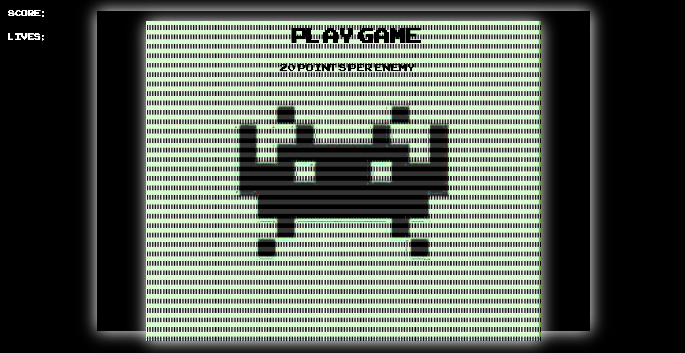
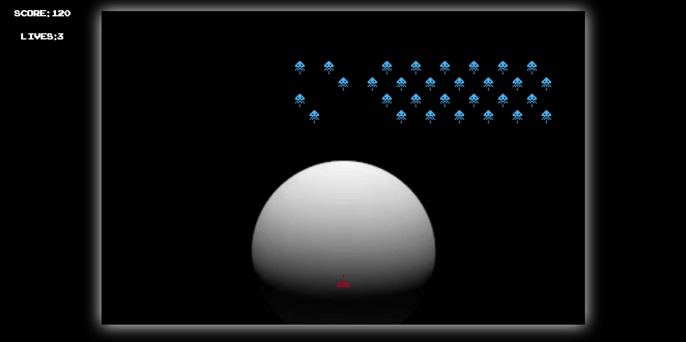

# WDI-Project-1
# WDI 1st Project - Space Invaders



In this project we are given the choice between 10 or so games. I chose Space Invaders because it is a game I enjoy playing and would like to know more about how its made.

During this project I worked by myself to build a game which runs through the client browser. I used HTML, CSS and Javascript to create the application. We were given one week to  complete it. I was eager to start this as I knew it would allow my creative side to show.


## Getting started


-install dependencies `yarn install`
-Open in browser

## Brief

* **Render a game in the browser**
* **Switch turns** between two players
* **Design logic for winning** & **visually display which player won**
* **Include separate HTML / CSS / JavaScript files**
* Stick with **KISS (Keep It Simple Stupid)** and **DRY (Don't Repeat Yourself)** principles
* Use **Javascript or jQuery** for **DOM manipulation**
* **Deploy your game online**, where the rest of the world can access it
* Use **semantic markup** for HTML and CSS (adhere to best practices)

## Technologies used

* **JavaScript (ES6)**
* **HTML 5**
* **React.js**
* **Git**
* **Github***
* **SCSS**
* **Animate CSS**


-
## Features

- User friendly, fun design. Created to capture an audience.
- Sound effects from original arcade game.
- Shows the score you are currently on.

## Planning

SPACE INVADERS*************
Variable declarations
Class
Constructor (enemies)
Constructor (bullets)

MISSION STATEMENT     ******************

To provide and produce a working modern and contemporary version of the arcade game space invaders.

The style and aesthetic i'm going for with this game is classic and original. Ive used a space invaders asset folder and used themed sounds, gifs and icons to style the game.

PSUEDOCODE    ***********************

Cache the DOM

Variables

Score
Aliens []
Has game started = false
Space between aliens
Enemy speed
Level
Lives

Functions

- create new game
Start game
Play audio
enemy movement( move from x and y axis and closer to player)
Player movement check to see location (how far to user)
Shoot function check and see if it hits enemy and what will happen if so
Score counter
Key movements
Speed of invaders
Speed of player
Enemy die (change image)
Player die
Win round
Lose round
End game (enter you name……present score)


New game - start new game (scores and timer display)


Play audio function

Grid row - numbered divs from 0 - 52

Enemy movements

Movement of enemies starts (div container moving left (every second) until
end of grid then forward one space - then enemies move left all together/ loop
through them and then shift them one div to the left.

Character movemenet

Initialise movement of character, + button features when left button Is
Pushed character moves left by one grid. Right by one grid when that certain
button is pressed. (change image of div to next div if left button is pressed and visa
versa.

Character shoot

Make new class for bullets, save and push to an array,

Enemy shooting - only front row of div can be shot, if the div is invisible(hit), then
the enemy in the row behind may shoot. Random selector of shooting (front row
Only)      

Shooting function - when space bar is pressed, image of shoot is fired straight
line, If enemy is hit then change picture to enemy hit image (remove).

The image is moved from the div its currently positioned at and moved in a straight
line to the end of the game


Shooting function. Move image of the bullet in a straight line up the grid row

If shooting arrow hits an enemy then plus 20 points onto score board

User die - if lives is === 0 then game over screen


For loop 53 or something times and  create  element and append to child.

Move shooting image up per div every 0.1 seconds so the transition is smooth

Bare in mind the time each person hold the key for.


## Contributing

Pull requests are welcome. For major changes, please open an issue first to discuss what you would like to change.
Please make sure to update tests as appropriate.

## Development

There were plenty of things to plan here before starting to code. First I needed to produce a grid which will contain all of the enemies and the player itself. I worked out the width and the height and produced this piece of code:

```  function startsGrid(){
let loopCount = 0
for(let i = 0; i < Math.floor(height * width); i++) {
loopCount ++
const $div = $('<div></div>').addClass('cell')
$div.attr( 'id', i)
cellArray.push($div)
$gameBoard.append($div)
```
having multpilied the height and width together, which i set up in a global variable. I realised, that id set up the grid incorrectly. The divs were not even in the container for example, one row might contain 33 cells where another row 32. This would cause problems down the line when it came to moving the baddies. When i first rendered the enemies on screen, I noticed a bug where one class would remove whilst the next grid was added. This caused the enemies to move on top of each other causing an overlapping effect. To overcome this I worked out the modulo of dividing by  two on the enemy row, making every other cell invisible:

```
if(i > 6 && i < 25 && i%2) {
baddieArray.push(new Baddie(i, 20))
} else if (i > 39 && i < 58 && i%2){
baddieArray.push(new Baddie(i, 20))
} else if (i > 72 && i < 91 && i%2){
baddieArray.push(new Baddie(i, 20))
} else if (i > 105 && i < 124 && i%2){
baddieArray.push(new Baddie(i, 20))
}
}
```
When it came to moving the enemies forward, the inconsistent grid would become a problem. I had to ensure that whether it was 33 steps or 32; the classes would add and remove in synergy with each other:

```
function moveBaddies() {
movementId = setInterval(() => {
baddieArray.forEach(baddie => baddie.baddieMove())
if(direction === 33) direction = -1
if(baddieArray.find(baddie => baddie.currentIndex % 33 === 32) && direction === 1) {
direction = 33
}

if(direction === 66) direction = 1
if(baddieArray.find(baddie => baddie.currentIndex % 66 === 33) && direction === -1) {
direction = 66
}
}
, 300)
}
```


## Wins and Blockers

The biggest issue I came across working on this project was creating the grid. I found that if I set the width and height to a reasonable number ie 10 x 10, then I wouldnt have had issues pinpointing the location of where the enemies are or where the player is.

I learnt two invaluable things whilst creating Space Invaders. The first is scope. There were certain blocks of code that I wanted to use again for example the remove enemy function. However, because this was defined in a seperate constructor class, I was unable to use it. The second was to learn time management. There was the odd occasion where i'd get stuck on a section and the code would break immediately. Sometimes I would spend up to a day or two to fix it.

Learning to put a temporary layer on top of the game was invaluable to learn. I wanted to have a start game page which would hold the highest scores in its local storage and render them onto the page. I achieved this by adding and removing a class dependant on an event  listener.


## Bugs

Below is a list of some of the known bugs within the app:

* The application doesn't show a message to screen when the game is won, the page has to be manually refreshed.
* When the enemy rows get to about half way down the screen they become buggy and move inconsistent to how they have been. This is a direct relation to the way in which  the grid was created.


## Future Content

Along with any known bugs that need fixing, there are numerous other elements I wish to introduce in the future:

* As spoken about earlier in this readme, I wish to show the highest scores of the users who have recently played.
* Different levels, by increasing the speed in which the aliens move.
* Profiles, so people can interact and share results/scores.
